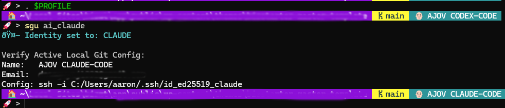

# Personal Agent Git Prompt



I created this tool for my own daily workflow to manage local AI development agents (like Claude, Gemini, and Codex) alongside my personal Git identity.

This is my practicing workflow: I write GitHub Issues to provide task instructions and context for AI agents, accessing them via either the **GitHub CLI (`gh`)** or a **GitHub MCP server**. Switching my local Git identity before an agent runs guarantees that all generated commits carry the agent's dedicated credentials and SSH key, maintaining a clean and isolated git history.

---

## Setup & Installation

### 1. File Structure

Keep both script files in the same directory (for example: `$HOME\ps-scripts\`):

- `sgu.ps1` – Core identity-switching logic.
- `sgu-loader.ps1` – Lightweight loader function.
- `prompt.ps1` – Dynamic terminal prompt that visualizes the currently loaded local Git identity (user/agent) and branch state directly in your shell.

### 2. Configure Your Profile

Open your PowerShell profile in Notepad:

```powershell
notepad $PROFILE
```

Add these dot-source lines to automatically load your scripts on terminal launch:

```powershell
. "C:\path\to\repo\prompt.ps1"
. "C:\path\to\repo\sgu-loader.ps1"
```

Reload your PowerShell profile to apply changes:

```powershell
. $PROFILE
```

---

## Usage

Run `sgu` inside any Git repository root to switch active local identity:

- `sgu personal` — Switch to your default personal Git identity.
- `sgu ai_claude` — Switch to Claude agent identity.
- `sgu ai_codex` — Switch to Codex agent identity.
- `sgu ai_gemini` — Switch to Gemini agent identity.

---

## Live Identity Visualization (`prompt.ps1`)

`prompt.ps1` provides immediate visual confirmation of the active local Git configuration right in your terminal prompt.

- **Real-time Visibility:** Instantly shows the loaded Git user identity (whether it's your primary developer account or a specific AI agent) currently active in the repository session.
- **Context Aware:** Displays the active Git user alongside your current branch, making session state obvious at a glance or when reviewing terminal logs.

---

## Adding Your Own Agents

Because I built this to fit evolving AI workflows, it's super easy to extend. If you use tools like **Cursor**, **Devin**, or custom local models, you can add them to `sgu.ps1` in seconds:

1. **Open `sgu.ps1`** in your code editor.
2. **Add a new profile block** under the switch statement with your agent's details:
   ```powershell
   'ai_cursor' {
       git config --local user.name "YourName-Cursor"
       git config --local user.email "cursor.bot@example.com"
       git config --local core.sshCommand "ssh -i $GitHome/.ssh/id_ed25519_cursor"
       Write-Host "🤖 Identity set to: CURSOR" -ForegroundColor Blue
   }
   ```
3. **Run `sgu ai_cursor`** inside any Git repository root to instantly switch.

---

## Roadmap & Future Plans

- **Current State**: Built for **PowerShell** on Windows, which is what I primarily use right now.
- **Future Work**: Add **Bash/Zsh (`sgu.sh`)** support for Ubuntu and Unix environments down the road so I can run these agent workflows on remote Linux servers and containers.
